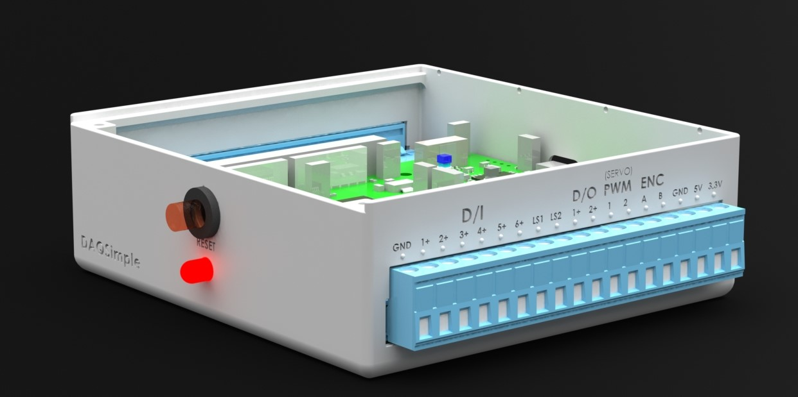

<!-- PROJECT SHIELDS -->
<!--
-->


<!-- PROJECT LOGO -->
<br />
<p align="center">
  <a href="https://github.com/othneildrew/Best-README-Template">
    
  </a>

  <h3 align="center">DSX Safe Data Acquisition System</h3>

  <p align="center">
    An open source, safe, and general purpose DAQ card for university students! 
    <br />
  </p>
</p>


<object width="425" height="350">
  <param name="movie" value="https://youtu.be/iJyCrCniYdE" />
  <param name="wmode" value="transparent" />
  <embed src="https://youtu.be/iJyCrCniYdE"
         type="application/x-shockwave-flash"
         wmode="transparent" width="425" height="350" />
</object>

<!-- TABLE OF CONTENTS -->
<details open="open">
  <summary>Table of Contents</summary>
  <ol>
    <li>
      <a href="#about-the-project">About The Project</a>
    </li>
    <li>
      <a href="#getting-started">Getting Started</a>
      <ul>
        <li><a href="#prerequisites">Prerequisites</a></li>
        <li><a href="#installation">Installation</a></li>
      </ul>
    </li>
    <li><a href="#usage">Usage</a></li>
    <li><a href="#roadmap">Roadmap</a></li>
  </ol>
</details>


<!-- ABOUT THE PROJECT -->
## About The Project

This code base is for the firmware that will power the DSX which is based around the STM32-G474RE MCU from STMicroelectronics.
The aim of this product is to assist university engineering students with their projects in fields such as robotics, control, and data acquisition. 

Main Features:
* Over current & over votage detection through interrupts 
* Interfaces with Matlab Simulink
* Modularized code base for easy contributing

This is a capstone project that started in January 2021 with the goal of integrating into a pick and place robotic arm project.
Thanks to all the developers who are contributing to this project and helping it grow.


<!-- GETTING STARTED -->
## Getting Started

Follow the steps below to start developing on the firmware.

### Prerequisites

Install the STM32Cube IDE
* [STM32Cube IDE](https://www.st.com/en/development-tools/stm32cubeide.html)

### Installation

1. Clone the repo
   ```sh
   git clone https://github.com/DAQSimple/DSX_fw
   ```
2. cd into the working directory
   ```sh
   cd DSX_fw
   ```


<!-- USAGE EXAMPLES -->
## Usage

Use this space to show useful examples of how a project can be used. Additional screenshots, code examples and demos work well in this space. You may also link to more resources.

_For more examples, please refer to the [Documentation](https://drive.google.com/drive/u/0/folders/1v6Ogk9cWeK-9JGX7ApI4z3O4f6FaFJ_J)_


<!-- ROADMAP -->
## Roadmap

See the [open issues](https://github.com/DAQSimple/DSX_fw/issues) for a list of proposed features (and known issues).


<!-- CONTRIBUTING -->
## Contributing

The collaborate development model being used in this project is shared repository

1. Create your Feature Branch (`git checkout -b feature/AmazingFeature`)
2. Commit your Changes (`git commit -m 'Add some AmazingFeature'`)
3. Push to the Branch (`git push origin feature/AmazingFeature`)
4. Open a Pull Request
5. Wait for merge

<!-- Git GUI -->
## Git GUI

If you prefer working with git on a GUI instead of the command line terminal, you can try using the following:

* [GitHub Desktop](https://desktop.github.com/)
* [Git Kraken](https://www.gitkraken.com/)
